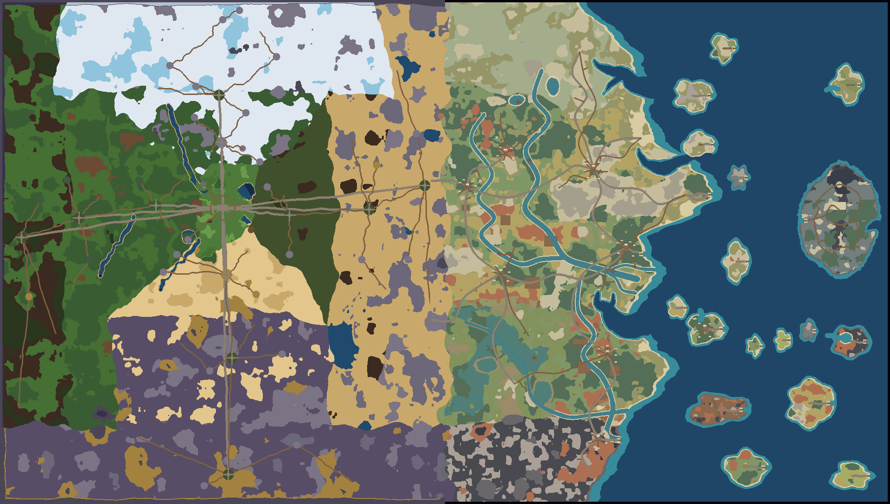

# Greek expansion rebuild

Status: the rebuilt expansion was released on 19 September 2026 through PR #4 at the owner's request. This follow-up repairs Greek trading posts, the Gate Market, ship visibility and boarding, and waypoint coverage.

## Original game comes first

The Chronicle, migration dashboard and expansion shortcuts have been removed. The original title, Journal, Skills, Anvil and pause menu remain. Switching tabs saves but no longer inserts an automatic pause screen. Field objectives are learned by exploration and tracked through the ordinary Journal. Recipes belong at anvils, ships at harbours, and practice at statues in the temple.

The mainland and the Three Hundred have no level lock. Difficulty comes from enemies and the expedition itself. The army still must be defeated to reach Leonidas, as requested. No global old-world checklist blocks the border.

Original equipment generation, forging, Crown upgrades, Life Siphon, Arrow Rain and original boss attack resolution are compared directly with pre-expansion source. New Greek rules are scoped to new content. The rebuilt loader can safely rejoin progress made while production was rolled back.

## Geography and settlement direction

The eastern half remains exactly the area of the old world. Terrain uses the original layered noise, ridges, moisture variation and scatter grammar, with separate Greek geology, colours and vegetation. Only the old eastern rim changes in the west, opening a broad natural transition. Coasts have a northern fjord, a hooked military cape, a deep southern gulf, beaches, cliffs, river mouths and volcanic shores. Six curving rivers, braided delta channels, farms and groves shape routes.

The Greek provinces no longer borrow western snow, poison bog, forest-floor or desert materials. Nineteen new materials provide thyme cushions, laurel leaf mould, Olympian alpine flowers, bedded limestone, golden terraces, Eurotas red earth, reed banks, delta silt, reed pools, porous pumice, glassy obsidian, storm heath, golden gardens, shell sand, black volcanic sand, clear karst springs and vineyard furrows. Raised limestone and obsidian have their own exposed cliff faces. Twelve new scenery designs include laurel, plane trees, umbrella pines, juniper, asphodel, oleander, papyrus, tamarisk, saltbush, mastic, pumice and obsidian. They follow the existing layered pixel-art drawing and collision system.

Every named island has a distinct outline and a local composition: vineyards and palace ruins, bronze giant footprints, a petrified orchard, livestock pens, ruined wings, siren stacks, a flooded theatre, a caldera, a giant's table or sister-island histories. Asterion uses connected island routes and a terraced ascent to a monumental temple.

Eight settlements have compact lanes, working stalls, house thresholds, gardens, storage, inns, forges and trade interiors. Fifty-seven Greek residents have local dialogue, supplies and services; outdoor workers follow routes between their actual homes, work and evening gathering places. Furniture and paths must remain reachable using the real collision rules.

## Art, sound and discovery

Greek textures and architecture are drawn through the existing pixel-art renderer: weathered stone, roof shingles, bronze, watermills, warehouses, porticoes, fishing gear, baskets, vines and household details. New art keys are checked for missing renderer cases. Light sources use the original day/night lighting.

The sea has a separate low-contrast depth texture, a broad transition from turquoise shallows to deep blue, travelling swells across tile boundaries, wind-broken whitecaps and local shoreline breakers. Each beach wave approaches, brightens, runs up shell or black sand, leaves a damp fringe and retreats. Shore contours follow the actual water around every island, headland and bay; they do not use distance from the mainland. Deep water never casts a wall face or a downward wall shadow onto land. Rock, piers and marble quays occlude foam using the renderer's actual shoreline masks. Rivers, karst springs, Lerna pools and the Styx retain their own water treatment. Waves use visible chunks and a bounded 48-chunk geometry cache, with no additional full-world canvas or per-frame canvas readbacks.

Ten Greek music arrangements use the original synthesized soundtrack system. Original music definitions are unchanged. Sailing, thunderstorms, resonators, army chapters and royal phase transitions have finite sound cues. Region changes reuse the same scheduler.

The royal antechamber has a usable Oathsteel Anvil, storage and forge fire. Recipes and earned royal choices use the ordinary Anvil panel. On narrow phones, Journal, Anvil and Shipwright keep the original styling and stack their independently scrollable list and details so actions remain reachable.

The 57 field activities use individually authored scenes. Small discoveries have a single relevant object; puzzles expose their actual mechanisms. Evidence, routes and encounters use the terrain and local story rather than identical rows of quest stones. Rewards and persistence still use the existing tested activity machinery.

The five Underworld areas also have their own environmental stories: cargo and customs ruins at Charon's quay; personal memorial plots in Asphodel; cultivated beds and a winter quarter in Persephone's garden; judgment desks and sealed tribute at Hades' court; boulders, an empty banquet and leaking-vessel imagery for the punishments in Tartarus. Existing lights, plants, furniture, stone and bronze props supply the detail while keeping the routes open.

## Trading, ships and return travel

All eight Greek trading posts have a named shopkeeper behind the counter at every hour, with ordinary buy/sell dialogue and local provisions. Thyra's Gate Market opens into a caravan trade hall with Lysandra, storage and a noticeboard that opens the existing Journal. There are 25 inhabited service interiors. The Gates of the Last Shore entrance explicitly offers the Three Hundred battle and explains how victory opens the harbour toward Leonidas. Dungeon prompts sit at the visible doors.

Purchased ships remain visible beside their wooden piers, and their saved berth survives refresh. Existing purchases recover a berth without buying again. The Shipwright says **Board ship** and explains that it starts sailing; the same action appears with **E** at the end of the pier. Coming ashore does not immediately board again on the same key press. Ferries preserve a consistent ship berth.

The Greek network has 51 waystones: eight towns, nineteen surface dungeon entrances, nineteen harbours and five Underworld hubs. An island becomes a return destination after actually docking there. Underworld stones are discovered and revisited inside their own maps. The army entrance supports retries before victory; its harbour opens after victory. Asterion remains accessible only by sea. Existing discovery and docking receipts retain earned travel without replaying discovery XP.

## Verification record

Validated locally on 19 September 2026, using one build/test process at a time on the 8 GB Mac:

| Check | Result |
| --- | --- |
| `npm run check:aegean` | All fifteen serial groups passed: references, original NPCs, content, recovery-save reconciliation, marine rendering, Greek residents/audio, world geometry, waypoint coverage, activity scenes, encounters, class diagnostics, services, real-Game integration, original-mechanics parity and original-art parity. |
| World geometry, seeds 1337 and 42 | Passed: exact map doubling; frozen original world outside the former eastern rim; twenty usable docks; no foot route to Asterion; connected entrances, objectives, activities and island anvil. |
| Original-mechanics comparison against Git `d39d75a` | 615 loot cases, four forging/Crown/load sequences, Life Siphon, Arrow Rain and every original boss attack passed. |
| Original-art comparison against Git `d39d75a` | Ordered Canvas2D drawing commands and source surfaces match for all 196 original tile variants, 48 wall faces and eight transition masks. All 76 variants of the 19 new materials have distinct drawing commands. |
| Greek biome identity | Finished worlds reject copied western natural terrain inside Greek regions and require regional material signatures. The narrow old-world transition strip is explicitly exempt. Seeds 1337 and 42 pass. |
| Marine rendering | Actual paint-call fixtures pass for all shore orientations, concave/convex coasts, tiny islands and channels, inland-water exclusion, run-up/retreat, camera continuity, cache eviction/revisions and exact clipping against all eight hard-bank masks. Static depth blending is checked for continuity and material boundaries. |
| Activity scenes and residents | All 57 scenes, 176 interaction objects, 57 residents, actual outdoor paths and indoor furniture passed. Journal tracking resumes existing unfinished stories without erasing evidence or paying rewards. |
| Trading and travel follow-up | All 25 service interiors inhabited; eight staffed stores; Gate Market threshold and buy/sell; 51 waystones; first-discovery XP and quests exactly once; island docking receipts; five actual Underworld destination maps; physical pier boarding, ferry mooring and legacy ship recovery passed. |
| Browser trading and ship follow-up | Entered the Gate Market with E, spoke to Lysandra across the counter, opened her shop, checked the trading-post clerk, bought a Coastal Skiff through the Shipwright, saw it beside the pier, boarded and landed with E, then refreshed and pressed Continue with the same ship and gold. Acheron’s stone opened the ordinary travel menu and returned to Thyra. No application console errors. |
| Production build | TypeScript and Vite passed. |
| Built browser, desktop | Actual door entry, refresh → Continue, dock purchase → embark, earned recipe display, island royal weapon selection, heroic talent selection and original Pause actions checked. No browser errors reported. |
| Built browser, 390 × 844 | Journal, Shipwright and Anvil inspected; lists/details scroll within the panel and no longer clip off the screen. |
| Save roundtrip | Reload and actual Continue click restored the same inn, character, position, gold and royal item. Automated scenarios also cover original saves, rollback progress, held Greek items and positions stranded by a rebuilt coast. |

Browser review used a separate local test character, controlled travel, invulnerability and explicit earned-reward fixtures to reach the relevant interfaces. Shoreline captures additionally disable local enemy spawning so the waves can be inspected without combat overlays. The surf recording captures the running game's canvas; the renderer and wave timing are unmodified. These are interaction and rendering checks, not a human victory over Leonidas. Audio checks cover arrangements, scheduler lifetime and finite cues; they do not constitute an independent listening review. Long-session pacing and difficulty across human playstyles still need playtesting.

The expansion release replaced the temporary rollback through merge `01aa6e7` (PR #4). Production publication of these follow-up fixes uses the same production branch and requires a successful Vercel deployment plus an independent public-build check.

## Actual generated world and browser captures

The atlas below is rendered from seed 1337's actual tile data using the game's map palette. It is not a concept image. Browser captures use the built local game; the temple uses a taller viewport to show the full facade.

| Place or interface | Capture |
| --- | --- |
| Thyra square and an actual house entrance | [Town](review/thyra.png), [door](review/house.png) |
| Furnished Split Amphora inn | [Inn](review/inn.png) |
| Shipwright and sailing | [Harbour](review/shipwright.png), [ship](review/sailing.png) |
| Moving surf and two beach materials | [Nine-second surf recording](review/surf-motion.webm), [shell beach](review/shell-surf.png), [black beach](review/black-surf.png) |
| Greek natural biomes | [Laurel grove](review/laurel-grove.png), [Olympian meadow](review/olympian-meadow.png), [Lerna reeds](review/reed-delta.png), [Eurotas](review/eurotas.png) |
| Temple of the Last Oath | [Temple](review/temple.png) |
| Tartarus and Persephone's cultivated beds | [Underworld](review/tartarus.png), [garden](review/persephone.png) |
| Original Journal and Anvil with Greek content | [Journal](review/journal.png), [Anvil](review/anvil.png) |
| Phone layouts | [Journal](review/journal-mobile.png), [Anvil](review/anvil-mobile.png), [Shipwright](review/shipwright-mobile.png) |
